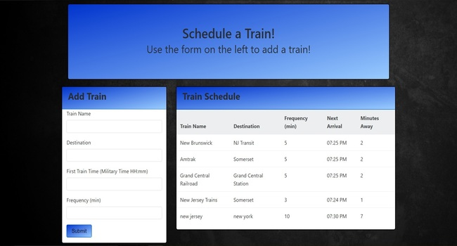

# TrainScheduler

## Description
A web app where the user can schedule mock trains. The trains are timed and stored using Google Firebase. Give it a try! https://khoernlein90.github.io/TrainScheduler/

## Technologies Used
* HTML
* CSS 
* Bootstrap
* JavaScript
* jQuery
* Firebase

